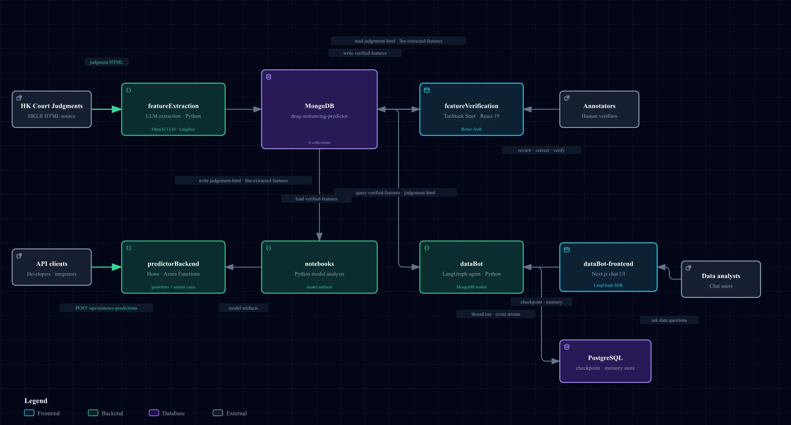

# HKLII drug sentencing predictor

This monorepo extracts features from Hong Kong court judgments, verifies them, trains sentencing models, and serves predictions and data chat.

## System diagram

[Open the interactive diagram](diagrams/system-architecture.html)

## Components

| Component | Purpose |
| --- | --- |
| [`featureExtraction/`](featureExtraction/) | Python LLM extraction from HKLII judgment HTML. |
| [`featureVerification/`](featureVerification/) | TanStack web app for human review and verification. |
| [`notebooks/`](notebooks/) | Data analysis, model fitting, and model artifacts. |
| [`predictorBackend/`](predictorBackend/) | Hono and Azure Functions API for sentence predictions and similar cases. |
| [`dataBot/`](dataBot/) | Python LangGraph agent for questions over verified data. |
| [`dataBot-frontend/`](dataBot-frontend/) | Next.js chat interface for data analysts. |
| MongoDB | Judgment HTML, extracted features, and verified features. |
| PostgreSQL | LangGraph checkpoints and memory. |

The main flow is:

`HKLII → featureExtraction → MongoDB → featureVerification → notebooks → predictorBackend`

`dataBot` reads verified data from MongoDB and serves `dataBot-frontend`.
